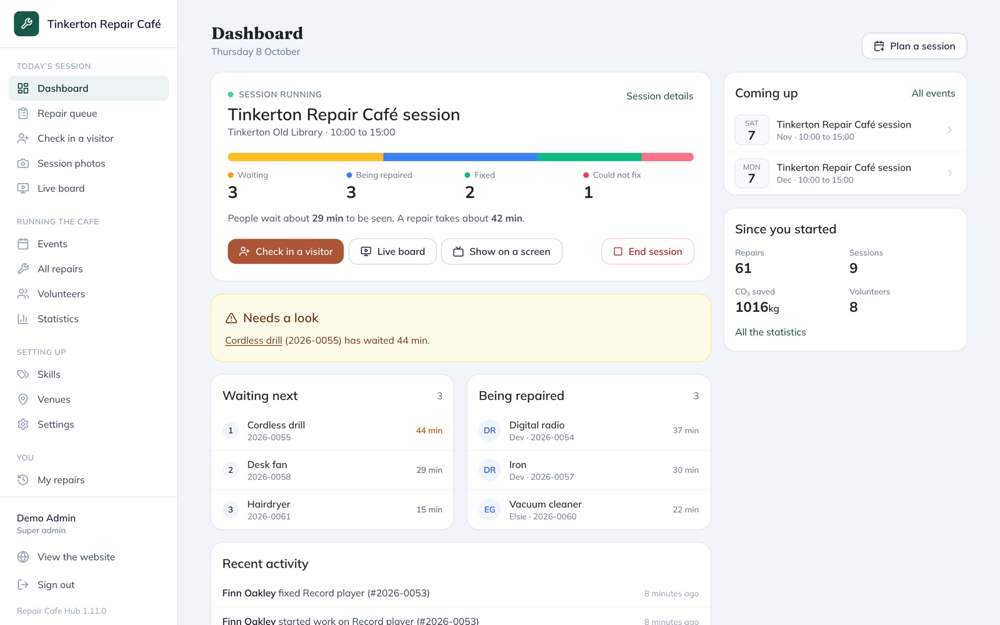
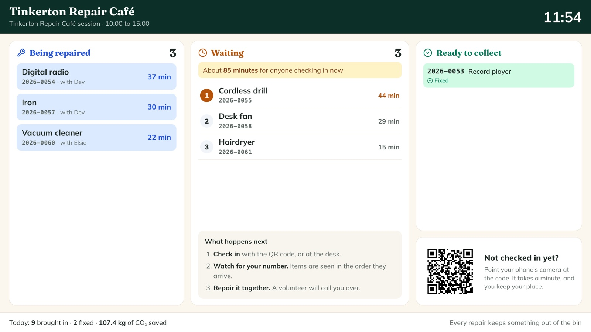
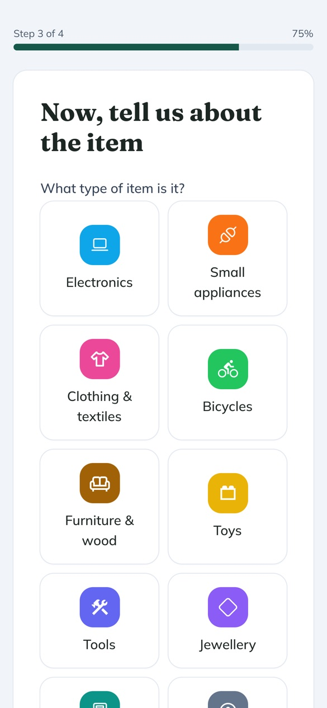
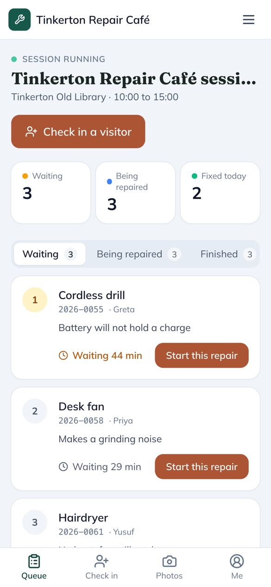
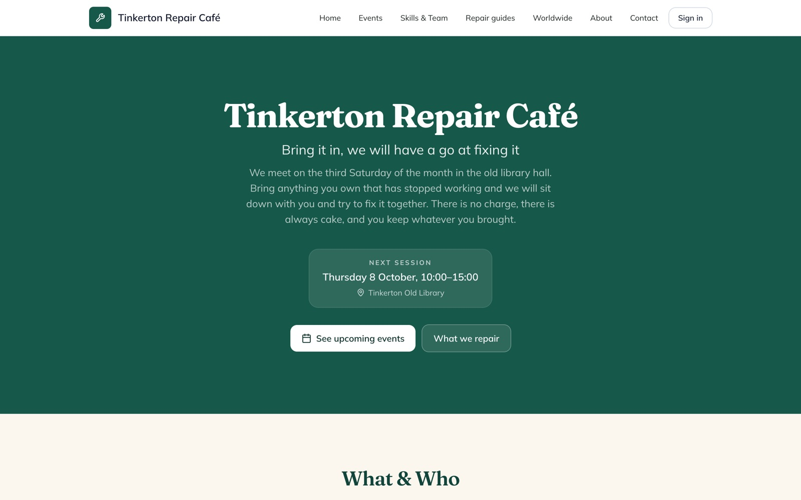
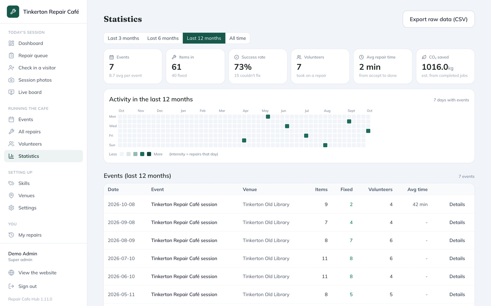

# Circularity Repair Cafe Hub

> Free, open-source software for grass-roots **repair cafes**. It is built and
> maintained as part of the [Circularity](https://circularity.org) community of
> repair groups, tool libraries and reuse hubs across the UK.

Everything a repair cafe needs to run a session: a public website, check-in by
QR code, a repair queue for volunteers, a screen for the waiting area, and an
admin area with reports.

It runs on a **free Cloudflare account**. There is no server to rent, nothing
to install on a machine of your own, and nothing to keep running. You set it up
once from your laptop, in about an hour, by following
**[the step-by-step install guide](./docs/install.md)**.



## Why?

Most repair cafes run on a clipboard, a spreadsheet and a WhatsApp group. That
works, but it loses the data that proves your impact, and it puts a lot of
admin on the volunteers. This is the tool we wished existed: simple enough to
set up in an afternoon, capable enough to track hundreds of repairs, and free
to run.

## Try it first

There is a live demo, so you can see the whole thing working before you
install anything:

**<https://repaircafe.hyperspanner.net>**

| | |
| --- | --- |
| Admin | `demo@example.com` / `DemoDemo123` |
| Repairer | `repairer@example.com` / `DemoDemo123` |

Sign in as the admin to see the dashboard, reports, sessions and settings. Sign
in as the repairer to see the repair queue the way a volunteer does on the day.
Or check an item in through the QR code, the way a visitor would.

**Click anything.** Tinkerton Repair Café is invented, and the site is wiped
and rebuilt whenever someone changes it. You cannot break it in a way that
lasts. Uploading photos and changing passwords are switched off, because the
password is published here. Please do not type real names, emails or phone
numbers into it.

## A look around

These pictures come from the demo cafe, part way through a session.

**The screen for the waiting area.** Put it on a TV so visitors can see the
queue, how long they may wait and what is ready to collect. It opens from a
private link with nobody signed in, and never shows visitors' names.



**On a phone.** Visitors check in by scanning the QR code on a poster.
Volunteers see the queue, oldest first, and take the next item.

<table>
  <tr>
    <td width="50%"></td>
    <td width="50%"></td>
  </tr>
  <tr>
    <td align="center">A visitor checking in</td>
    <td align="center">A volunteer's repair queue</td>
  </tr>
</table>

**Your cafe's website** shows your next session, what you repair and who you
are, in your own colours.



**Statistics** show what your cafe has achieved: repairs, success rate,
volunteers and CO2 saved, with every session listed.



## Features

- **Public website** with your own home page, photo gallery, upcoming
  sessions, team profiles, FAQs and branding.
- **Check-in by QR code.** Print a poster for each session. Visitors scan it
  with their phone and describe their item, with a photo, in four short steps.
- **A repair queue for volunteers.** Items are listed oldest first, with how
  long each has waited. Volunteers take an item, add notes, parts and photos,
  and finish it as fixed, not fixable, or coming back with a part.
- **An admin dashboard** built around the running session: the queue at a
  glance, long waits, who is working on what, and the sessions coming up.
- **A live board and a waiting-room screen.** Show the queue on a TV, with an
  estimated wait and what is ready to collect. A private link opens it on any
  screen with nobody signed in, and it never shows visitors' names.
- **Sessions and venues,** one-off or repeating, with a photo gallery for each
  session.
- **Reports:** repairs, success rates, categories, volunteers and CO2 saved,
  with CSV export. CO2 savings come from
  [The Restart Project's reference data](https://zenodo.org/records/5900046),
  not guesswork.
- **Repair guides** from [iFixit](https://www.ifixit.com/api-docs), searchable
  from your own site.
- **Maps** of every Repair Café in the world, and of the cafes near you, from
  [repaircafe.org](https://www.repaircafe.org/en/api/).
- **Linux Repair Cafe** (off until you switch it on): help people move an old
  computer to Linux instead of throwing it away, and record each install.
  See [docs/08-linux-repair-cafe.md](./docs/08-linux-repair-cafe.md).
- **Search engines and social media:** public pages carry structured data and
  sharing pictures in your colours, with a sitemap. Optional cookie-free
  analytics with [Plausible](https://plausible.io) or Quick Web Analytics,
  which can also count events such as items checked in.
- **Optional, honest numbers.** Your hub can send the project a daily count of
  repairs and sessions, but only if you agree, and you see the exact message
  first. It never contains a name, a note or any free text. See
  [docs/proposal-telemetry.md](./docs/proposal-telemetry.md).
- **Privacy by design:** strong password hashing, short-lived sign-in tokens,
  limits on password guessing, strict security headers, and visitors' contact
  details deleted after a period you choose.
- **Backups** of every record and photo, from the admin area. A backup also
  moves your hub to another Cloudflare account.

## Install

Follow **[docs/install.md](./docs/install.md)**. It starts from nothing and
explains every step, including how to install the tools you need.

In short, once you have a Cloudflare account with R2 switched on, and Git,
Node.js 22 or newer and pnpm installed:

```
git clone https://github.com/Zesty0wl/circularity-repair-cafe-hub.git
cd circularity-repair-cafe-hub
pnpm install
pnpm --filter @circularity/cloudflare exec wrangler login
pnpm cf:deploy --domain repair.example.org
```

Then open your address, and the setup wizard starts.

## Updating

Your hub does not update itself. It runs the version you published, until you
publish a newer one. That way nothing changes on a session day without you
choosing it.

**How you find out.** Once a day your hub asks GitHub whether a newer version
has been released. If there is one, the admin area shows a line saying so,
with a link to what changed. The check sends nothing about your cafe. To
switch it off, see [Settings](./docs/running-your-hub.md#settings).

**How you update.** On the computer you set the hub up from, open a terminal
in the hub's folder and run:

```
git pull
pnpm install
pnpm cf:deploy
```

It takes a few minutes. Your site stays up the whole time, your data and
settings are kept, and any database changes apply by themselves. Do it a day
or two before a session, so you have time to check everything.

**No longer have that computer?** You do not need it. Everything about your
hub is kept on Cloudflare, so you can update from any computer, even a
borrowed one, as long as you can sign in to your cafe's Cloudflare account.
The steps are in
[updating from a different computer](./docs/running-your-hub.md#updating-from-a-different-computer).
Make sure at least two people can sign in to that account: see
[if nobody can get into the Cloudflare account](./docs/running-your-hub.md#if-nobody-can-get-into-the-cloudflare-account).

**What changed** in each version is in the [changelog](./CHANGELOG.md).

## Documentation

**Setting up and running the hub**

- [Install the hub, step by step](./docs/install.md)
- [Running your hub](./docs/running-your-hub.md): settings, updating, limits
  and problems
- [Backups and moving a hub](./docs/backups-and-moving.md), including moving
  from the old Docker edition

**Using the hub**

- [User guides](./docs/README.md): getting started, branding, skills,
  sessions, running a session day, reports and GDPR
- [Repairer guide](./docs/repairer-guide.md), for your volunteers

**For developers**

- [How the hub works](./docs/how-it-works.md), including
  [releasing a new version](./docs/how-it-works.md#releasing-a-new-version)
- [The public demo](./docs/demo.md)
- [Changes in each version](./CHANGELOG.md)

## Stack

| Part | What it uses |
| --- | --- |
| Hosting | One Cloudflare Worker, on the free plan |
| Database | Cloudflare D1 (SQLite), through Drizzle ORM |
| Photos | Cloudflare R2 |
| Website | SvelteKit, drawn on the server, with Tailwind CSS |
| Tests | Vitest, running in workerd, the real Workers runtime |

## Repository layout

```
apps/
  web/          the website and admin area (SvelteKit)
  cloudflare/   the Worker: the API, the database and the hourly jobs
packages/
  shared/       types, validation and the backup format
demo/           the public demo's seed script
docs/           the documentation
.github/        checks for every pull request, and the demo's hourly reset
```

## Development

```
pnpm install
pnpm cf:test      # the tests, in the real Workers runtime
pnpm cf:dev       # the whole hub at http://localhost:8787, with a local database
pnpm dev:web      # the website with instant reloads, talking to cf:dev
```

[docs/how-it-works.md](./docs/how-it-works.md) explains how it is put
together.

## The old Docker edition

Until version 1.10 the hub ran in Docker, on a machine of the cafe's own. The
Docker edition is no longer developed. Its last images stay on
[GHCR](https://github.com/Zesty0wl/circularity-repair-cafe-hub/pkgs/container/circularity-repair-cafe-hub),
and its code is in the git history. A Docker hub moves to Cloudflare with
everything intact: see
[moving from the old Docker edition](./docs/backups-and-moving.md#moving-from-the-old-docker-edition).

## Contributing

This is a community project for the Circularity network and anyone else who
would benefit. Issues, ideas and pull requests are all welcome on the
[issue tracker](https://github.com/Zesty0wl/circularity-repair-cafe-hub/issues).

## Licence

[MIT](./LICENSE). Free for any community group, repair cafe, library, charity
or business to use, change and share. Credit to
[Circularity](https://circularity.org) is appreciated but not required.
